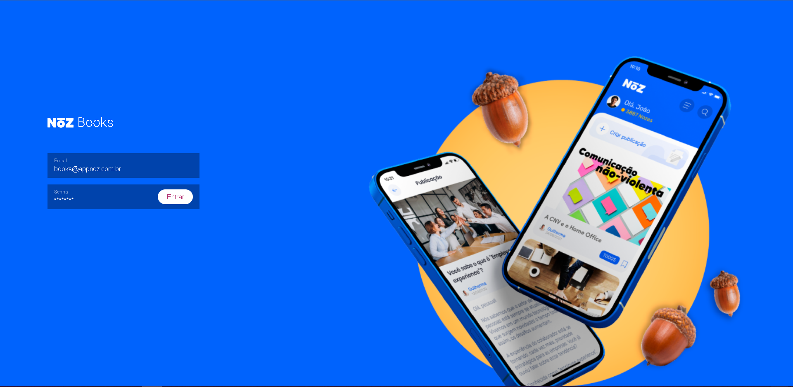
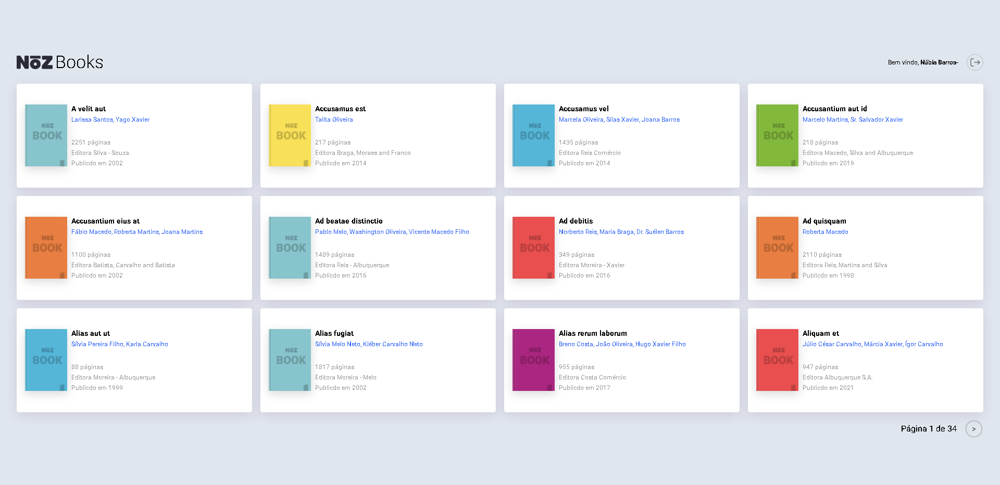
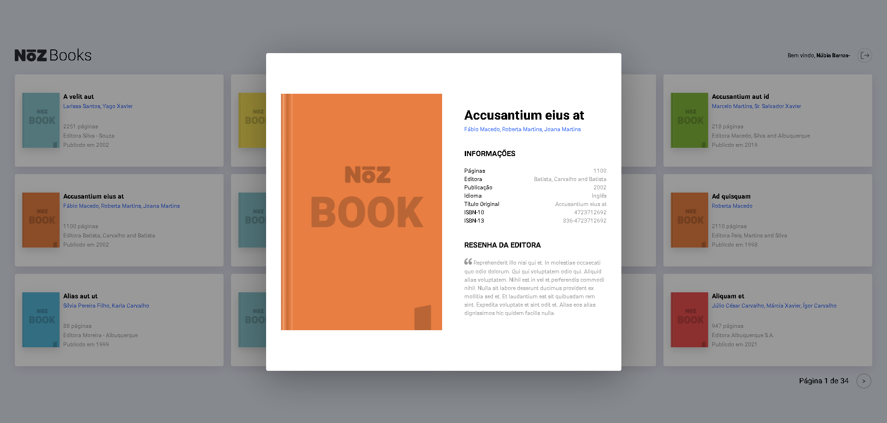
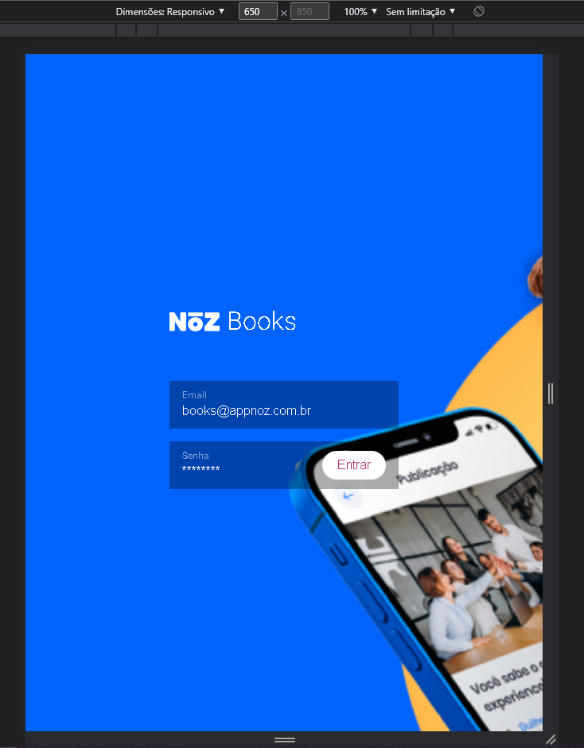
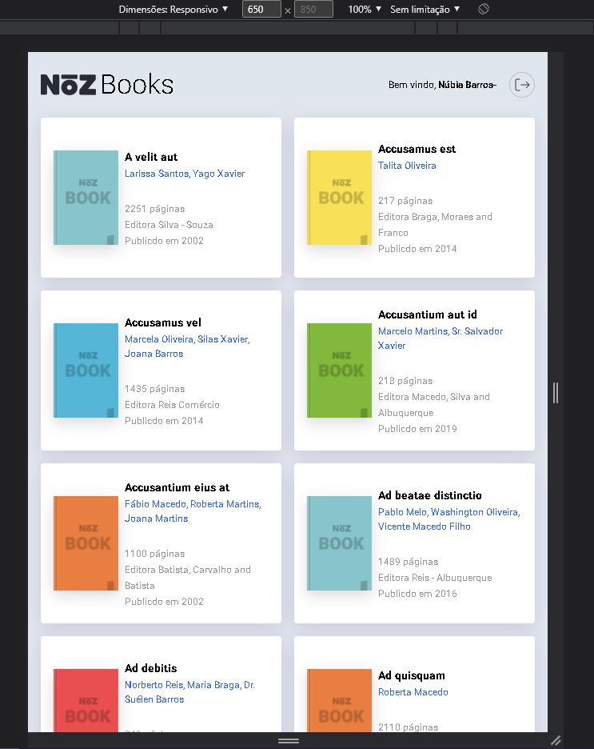
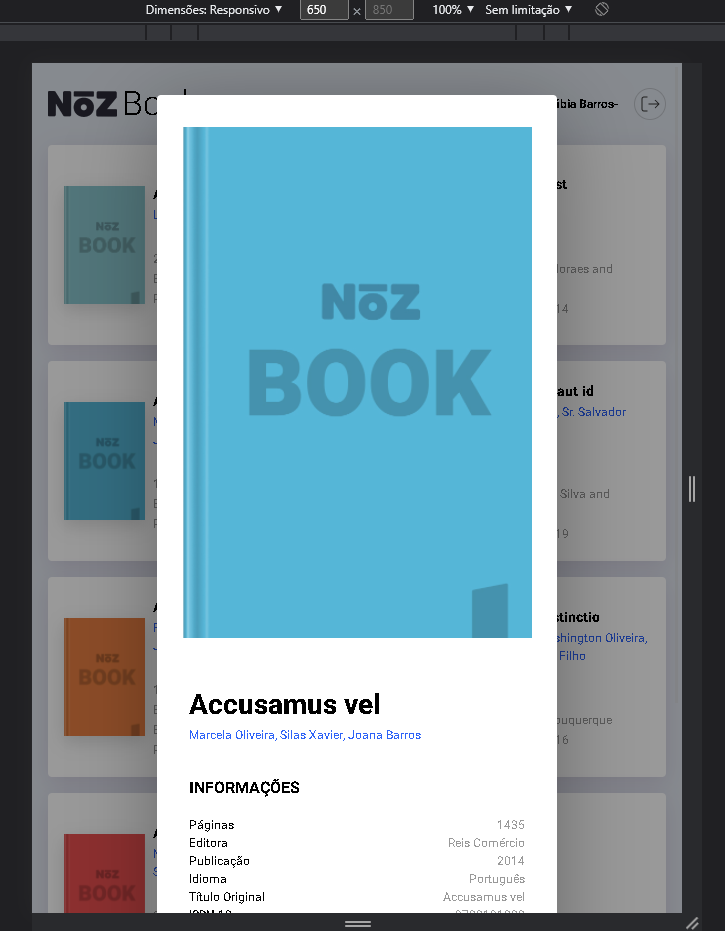
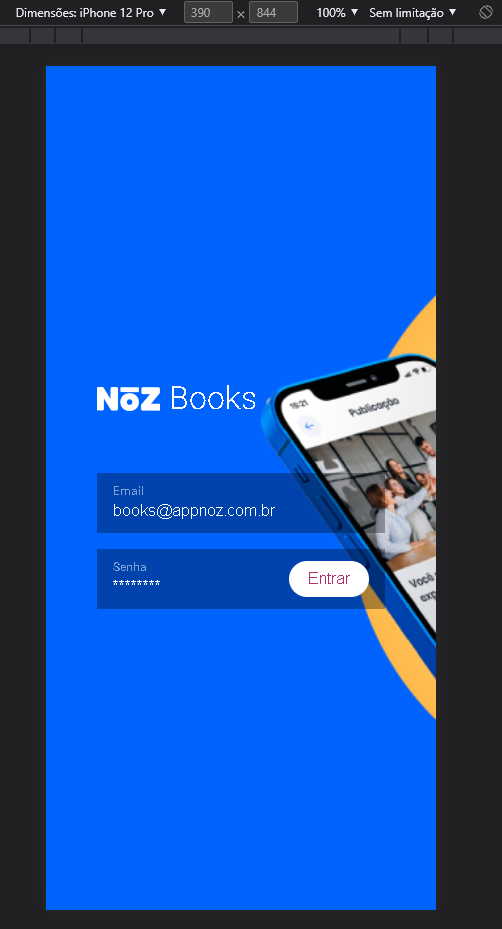
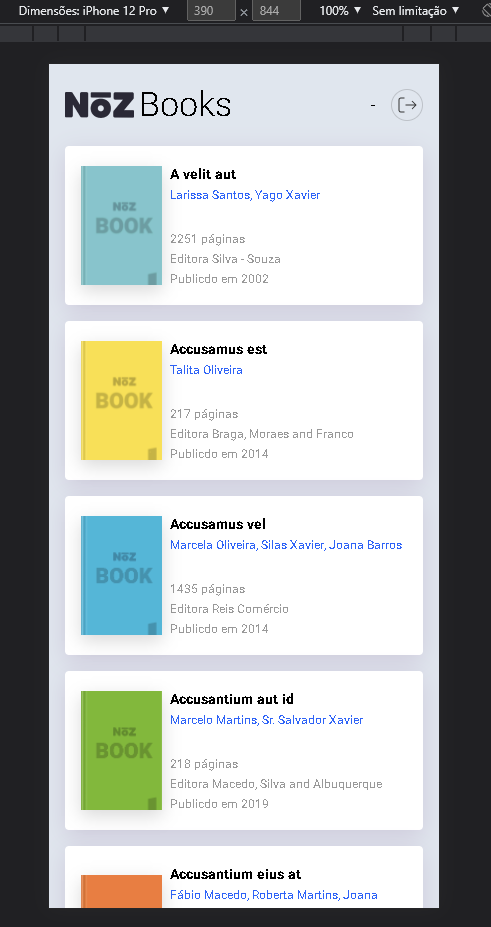

# APIRest with React, Typescript, Axios e Sass 🔥🏆 

Aplicação construída com react, typescript, vite, axios, react-router-dom e sass que acessa o servidor através de login e token, voltando dados do usuário e dos books 

## Code 👨‍💻

    yarn create vite noz-books --template react-ts
    |
    yarn
    |
    yarn add axios
    |
    yarn add react-router-dom
    |
    yarn add sass

## Layout 💻📱

Desktop 

Tablet 

Smartphone 

